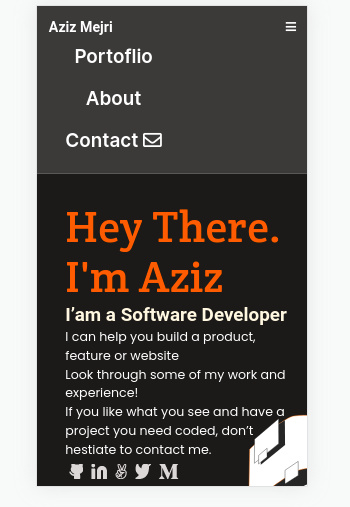

<!-- # curriculum-cr-training-mobile-menu

This repo host an initial code for the tasks performed during the Code Reviewers training.

Application is based on this [Figma design](https://www.figma.com/file/t3EJUCAEViw3QasuJLPLVT/Microverse-Student-Potfolio-Templates-Main?node-id=1%3A1471).

 -->

# curriculum-cr-training-mobile-menu

> This project is based on designing a mobile menu nav for an existing portfolio project.
> The inital code for this project is hosted on [this github repo](https://github.com/microverseinc/curriculum-cr-training-mobile-menu/tree/main)

## Built With

- JavaScript
- HTML
- CSS

## Live Demo

[Live Demo Link](https://rawcdn.githack.com/wandji20/mobile-menu/d88cf6aeab4528f79918886ef9cdacf49d4c070f/index.html)

## Getting Started

To get a local copy up and running follow these simple example steps.

- cd to a desired project directory for this project on your computer terminal.
- Run `git clone https://github.com/wandji20/mobile-menu.git` to clone this repo
- Open the project on your text editor and you are good to go.

## Author

👤 **Wandji Bertrand**

- GitHub: [@wandji20](https://github.com/wandji20)
- Twitter: [@wandjibertrand](https://twitter.com/wandjibertrand)
- LinkedIn: [wandji-bertrand](https://www.linkedin.com/in/wandji-bertrand/)

## Show your support

Give a ⭐️ if you like this project!

## Acknowledgments

- Microverse

## 📝 License

This project is [MIT](./MIT.md) licensed.
